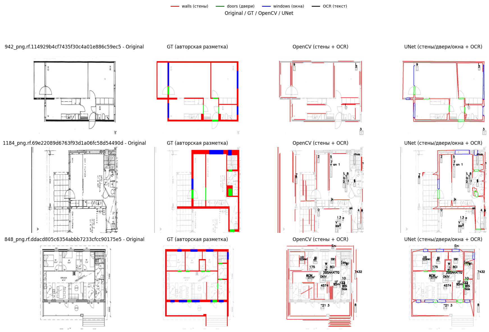

# Floorplan → JSON (OpenCV + UNet + OCR)




Небольшой прототип пайплайна, который по изображению плана квартиры строит
структурированный JSON с геометрией стен/дверей/окон и результатами OCR.

Используются два подхода:

- **Классический CV** (OpenCV) для выделения стен в виде сегментов.
- **UNet (ResNet34, 4 класса)** для сегментации стен / дверей / окон.
- **EasyOCR** для распознавания текстов и размеров.

Датасет: [**CubiCasa5k (COCO-версия)**](https://universe.roboflow.com/wall-segmentation-pj9zt/cubicasa5k-2-qpmsa-tppfc/browse?queryText=&pageSize=50&startingIndex=0&browseQuery=true)

---

## Структура репозитория

```text
.
├── assets/
│   └── overview.png         # коллаж Original / GT / OpenCV / UNet
├── notebooks/
│   ├── 01_eda_cubicasa5k.ipynb    # EDA датасета, примеры разметки
│   └── viz_predictions.ipynb      # визуализация GT / OpenCV / UNet / OCR
├── src/
│   ├── data_preprocess.py   # COCO-аннотации → GT-маски 0/1/2/3
│   ├── train_unet.py        # обучение UNet (ResNet34 encoder, 4 класса)
│   ├── cv_walls.py          # классический CV-бейзлайн по стенам
│   ├── ocr.py               # EasyOCR + повороты/флипы + NMS
│   ├── pipeline_cv.py       # общий инференс: CV / UNet / OCR → JSON
│   └── eval.py              # сравнение JSON-предсказаний с GT-масками
├── data/                    # сюда нужно положить CubiCasa5k COCO (gitignored)
│   └── cubicasa5k-2.v1i.coco/  # train / valid / test / *_annotations.coco.json
├── masks/                   # сгенерированные GT-маски 0/1/2/3 (gitignored)
│   ├── train/
│   ├── valid/
│   └── test/
├── model/                   # веса обученного UNet, логи (gitignored)
│   ├── unet_resnet34_best.pth
│   ├── unet_resnet34_last.pth
│   └── train_log.txt
├── outputs/                 # инференс + метрики (gitignored)
│   ├── viz_valid_100/       # json примеры для визуализации (cv + unet + ocr) (пара примеров)
│   └── test_pred/           # json предсказания для теста + metrics_*.txt (пара примеров)
├── README.md
└── .gitignore
```

### Формат GT-масок

После препроцессинга каждая маска имеет 4 класса:

- `0` – фон  
- `1` – стена  
- `2` – дверь  
- `3` – окно  

Маски строятся по COCO-аннотациям на основе bbox’ов, чтобы получить толстые сегменты для обучения UNet.

---

## Установка

```bash
python -m venv .venv
source .venv/bin/activate      # Windows: .venv\Scripts\activate

pip install torch torchvision torchaudio --index-url https://download.pytorch.org/whl/cu118  # или под свою CUDA/CPU
pip install segmentation-models-pytorch
pip install opencv-python numpy matplotlib tqdm
pip install easyocr
```

(Версия Python использовалась 3.10.)

---

## Как запустить (пошагово)

### 0. Подготовить данные

Скачать COCO-версию **CubiCasa5k** и распаковать в:

```text
data/cubicasa5k-2.v1i.coco/
  train/
  valid/
  test/
  train/_annotations.coco.json
  valid/_annotations.coco.json
  test/_annotations.coco.json
```

(Путь можно поменять, но в примерах ниже он именно такой.)

---

### 1. COCO -> маски (walls/doors/windows)

```bash
python src/data_preprocess.py \
  --data_root data/cubicasa5k-2.v1i.coco \
  --out_root masks
```

В результате появятся:

```text
masks/train/*_mask.png
masks/valid/*_mask.png
masks/test/*_mask.png
```

---

### 2. Обучение UNet

Используем train/valid разбиение, уже имеющееся в датасете:

```bash
python src/train_unet.py \
  --train_images_dir data/cubicasa5k-2.v1i.coco/train \
  --train_masks_dir  masks/train \
  --val_images_dir   data/cubicasa5k-2.v1i.coco/valid \
  --val_masks_dir    masks/valid \
  --out_dir          model \
  --epochs 30 \
  --batch_size 4 \
  --lr 1e-3 \
  --num_workers 4 \
  --patience 3
```

Скрипт логирует loss + mIoU в `model/train_log.txt` и сохраняет:

- `model/unet_resnet34_best.pth` - лучшая модель по **val mIoU** (на валидации).
- `model/unet_resnet34_last.pth` - модель после последней эпохи.

---

### 3. Инференс на `test` (без OCR, только геометрия)

Чтобы посчитать объективные метрики, OCR не нужен:

```bash
python src/pipeline_cv.py \
  --input_dir  data/cubicasa5k-2.v1i.coco/test \
  --output_dir outputs/test_pred \
  --use_cv \
  --use_unet \
  --device cuda \
  --no_ocr
```

Результат:

```text
outputs/test_pred/opencv_infer/*.json   # стены от OpenCV
outputs/test_pred/unet_infer/*.json     # стены/двери/окна от UNet
```

---

### 4. Оценка качества (eval.py)

Сравниваем JSON-предсказания с GT-масками. Скрипт сам поймёт, какие папки есть
(`opencv_infer` / `unet_infer`), и посчитает метрики для каждой.

```bash
python src/eval.py \
  --gt_masks_dir  masks/test \
  --pred_root_dir outputs/test_pred \
  --tolerant_radius 2 \
  --line_thickness 5
```

Результаты сохраняются в:

- `outputs/test_pred/metrics_opencv.txt`
- `outputs/test_pred/metrics_unet.txt`

---

### 5. Инференс + OCR для визуализаций (valid, 100 случайных картинок)

```bash
python src/pipeline_cv.py \
  --input_dir  data/cubicasa5k-2.v1i.coco/valid \
  --output_dir outputs/viz_valid_100 \
  --use_cv \
  --use_unet \
  --device cuda \
  --max_images 100
```

После этого в ноутбуке `notebooks/viz_predictions.ipynb` можно отрисовать
коллажи GT / OpenCV / UNet / OCR — как на картинке в `assets/overview.png`.

---

## Результаты

### Обучение UNet (валидация)

Лучший `val mIoU` по стенам/дверям/окнам на валидационном наборе ~0.66
(номер эпохи можно посмотреть в `train_log.txt`).

### Тестовый набор

Метрики рассчитаны на **тонких линиях**: JSON-полилинии -> растеризация в маску
с фиксированной толщиной (5 пикселей) и tolerant IoU с диляцией радиусом 2.
Сами числа лежат в:

- `outputs/test_pred/metrics_unet.txt`
- `outputs/test_pred/metrics_opencv.txt`

---

## Замечание про метрики

Метрики **слегка не объективны относительно исходной разметки CubiCasa5k**:

- GT в датасете - это **толстые области** (сегментация стен / дверей / окон).
- В прототипе для генерации JSON я привожу и GT, и предсказания к **линейному представлению** (walls/doors/windows как полилинии).
- Для оценки:
  - JSON-линии растеризуются обратно в маску фиксированной толщины.
  - Используются две версии IoU:
    - строгий IoU по маскам,
    - tolerant IoU с морфологической диляцией (радиус 2 пикселя),
  - плюс метрика средней дистанции от предсказаний до ближайшего GT-пикселя.

Поэтому абсолютные значения IoU/F1 нельзя напрямую сравнивать с числами из статей
по CubiCasa5k - это **метрики именно для задачи "линии -> JSON-геометрия"**, а не
для классической dense-сегментации.

---

## Идеи для улучшения

**UNet / сегментация**

- Использовать более сильный энкодер (ResNet50 / EfficientNet) и/или
  двухэтапную схему: coarse segmentation -> refinement вдоль линий.
- Добавить аугментации, специфичные для чертежей: perspective warp,
  морфологический шум, контраст/инверсию, лёгкий blur.
- Ввести loss с акцентом на границы (Boundary loss, Lovász, focal IoU).

**Пост-обработка / векторизация**

- Склеивать соседние отрезки в длинные полилинии, выпрямлять до
  горизонталей/вертикалей с учётом сетки.
- Удалять мелкие шумовые фрагменты по длине и по площади.
- Дополнительно искать помещения как полигоны по сегментации стен.

**OCR / текст и размеры**

- Улучшить фильтрацию OCR: кластеризация надписей по типу (“dimension” vs room label),
  поиск ближайшей стены/комнаты для привязки размеров.
- Для production-варианта стоит попробовать более современные OCR-модели
  (TrOCR, PaddleOCR) и обучить их на кусочках чертежей.

**“Грязные” фото**

- Добавить шаг выравнивания: поиск горизонта по Hough Lines, коррекция поворота.
- Для перспективных искажений - оценивать гомографию по внешнему прямоугольнику
  планировки и нормализовать вход.
